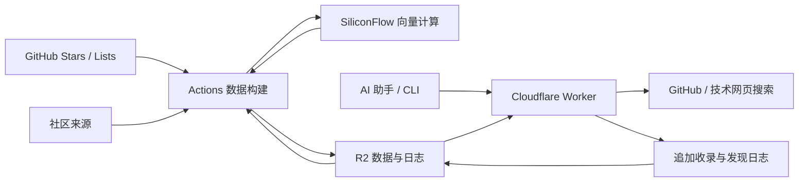

# Stars Radar 开发文档

本文面向部署者和贡献者，说明配置、数据流、接口和验证方法。日常操作见 [README](../README.md)，英文介绍见 [README.en.md](../README.en.md)。

## 项目组成

Stars Radar 包含三个部分：Node.js 数据管线、Cloudflare Worker 服务和 MCP / Python 客户端。管线获取个人 GitHub Stars、Lists 和社区数据，Worker 从 R2 读取索引并执行实时查询，客户端负责呈现结果。

项目没有前端应用、关系数据库或独立向量数据库。仓库保存代码和通用意图词表，用户数据保存在部署者自己的 R2 桶中。



| 路径                                                | 职责                                       |
| --------------------------------------------------- | ------------------------------------------ |
| `src/index.js`                                      | Worker 请求入口与 MCP 注册                 |
| `src/tool-schemas.js`                               | MCP 工具参数与说明的统一定义               |
| `src/search-engine.js`                              | 收藏、社区、入库日志与历史资产的检索编排   |
| `src/query-analysis.js`、`scoring.js`、`ranking.js` | 查询解析、词法匹配和排序                   |
| `src/documents.js`、`document-cache.js`             | R2 读取、缓存与数据状态                    |
| `src/ingest-journal.js`、`append-store.js`          | 日志键、追加写入与折叠                     |
| `src/repository-details.js`                         | 仓库详情、比较及证据来源                   |
| `src/live-probes.js`                                | GitHub 仓库、代码和技术网页搜索            |
| `scripts/index.js`                                  | 收藏同步与数据构建入口                     |
| `scripts/github_stars.js`、`github-lists.js`        | GitHub 分页、README 下载与分类同步         |
| `scripts/vector_pipeline.js`                        | 增量向量计算与本地文件输出                 |
| `scripts/asset_store.js`                            | 合并持久状态，生成热集索引和日志快照       |
| `skills/stars-radar/scripts/search_stars_cli.py`    | REST 命令行客户端                          |
| `test/`                                             | 独立造数的单元、契约与本地 Worker 集成测试 |
| `skills/stars-radar/`                               | 可选的 AI Agent 使用指南                   |

## 环境与配置

使用 Node.js 22.19.0 或更高版本及 pnpm 10。CI 通过 `.node-version` 安装 Node，包管理器版本来自 `package.json`。Python 客户端要求 Python 3.8 或更高版本。

```sh
pnpm install --frozen-lockfile
```

### 配置位置

| 位置                             | 使用者              | 配置方式                                          |
| -------------------------------- | ------------------- | ------------------------------------------------- |
| `.env`                           | 本地数据构建        | 从 `.env.example` 复制；`pnpm dev:stars` 自动加载 |
| `.dev.vars`                      | `wrangler dev`      | 从 `.dev.vars.example` 复制                       |
| Actions secrets / Worker secrets | 线上构建 / 线上服务 | 分别在 GitHub 和 Cloudflare 配置                  |

这三处不会自动互相同步。`pnpm build:stars`、收割脚本和 Python 客户端使用当前进程的环境变量；Python 不读取 `.env`。真实配置及其环境专用变体均被忽略，示例文件可以入仓。本地 secret 文件规则见 [Cloudflare 文档](https://developers.cloudflare.com/workers/configuration/secrets/)。

<!-- prettier-ignore -->
| 名称                                       | 用途                                                    |
| ------------------------------------------ | ------------------------------------------------------- |
| `GITHUB_TOKEN`                             | 本地构建和 Worker 的 Stars、Lists、GitHub 搜索及点 Star |
| `GH_TOKEN`                                 | 仅 Actions secret，在构建步骤映射为 `GITHUB_TOKEN`      |
| `SILICONFLOW_KEY`                          | 数据构建和 Worker 查询向量                              |
| `SILICONFLOW_URL`                          | 可选向量接口地址，默认 SiliconFlow embeddings 接口      |
| `MCP_API_KEY`                              | Worker 读取认证；未配置独立写密钥时保持旧版读写行为      |
| `MCP_WRITE_API_KEY`                        | 必填独立写密钥；capture / star / ingest 只接受它         |
| `MCP_TOOLSET`                              | MCP 工具暴露面：`research`（默认）/ `all`                |
| `R2_ACCOUNT_ID`、`R2_BUCKET`               | CI S3 上传及本地 R2 REST 操作的目标                     |
| `R2_ACCESS_KEY_ID`、`R2_SECRET_ACCESS_KEY` | Actions 的 S3 读写凭据                                  |
| `CLOUDFLARE_API_TOKEN`                     | 可选 CI 部署；本地收割与向量恢复的 REST 操作也需要它    |
| `WORKER_URL`                               | Python 客户端的服务根地址，不含 `/mcp`，没有内置地址    |
| `BRAVE_SEARCH_API_KEY`、`TAVILY_API_KEY`、`EXA_API_KEY`、`TAVILY_PROXY_KEY` | 可选网页搜索提供商，配置到 Worker secrets。Exa 可缺省 |
| `HTTP_PROXY`、`HTTPS_PROXY`                | 可选本地出站代理，Worker 不使用本地代理                 |

`ASSET_STORE_ROOT` 和 `VECTOR_STORE_ROOT` 是测试隔离入口，不是生产部署配置。生成数据使用项目内相对路径，测试在临时目录中造数并自行清理。

### GitHub 权限与分类

完整流程使用个人访问令牌，而非 Actions 自动生成的工作流令牌。Classic token 可选择 `public_repo` 和 `read:user`，用于公开仓库、用户 Lists 和收藏操作，无需为公开语料库申请读取私有仓库的 `repo` 权限。

Fine-grained token 对 Stars 读取要求 Starring read，点 Star 要求 Starring write 和 Metadata read，详见 [GitHub Stars API 文档](https://docs.github.com/en/rest/activity/starring)。选用这种令牌时还要验证自己的 GraphQL Lists 和代码搜索权限，不同接口的授权要求并不相同。Lists 读取不完整或无权读取时，构建会失败，不会把错误响应当成空分类发布。

同步排除私有仓库。分类名称按用户自己的 Lists 同步，取消分类会在下次成功构建生效；未分类仓库使用 `everything-else`。收录接口填写的标签属于 Radar 备注，不会修改 GitHub Lists。

## 首次部署与更新

首次部署步骤见 [README](../README.md#开始使用)。`wrangler.jsonc` 的 Worker 名称和桶名需要按部署环境填写，代码使用固定 R2 绑定名 `R2`，并声明 `EXPENSIVE_RATE_LIMITER` 与 `WRITE_RATE_LIMITER` 两个 Rate Limiting binding。R2 配置见 [Cloudflare R2 文档](https://developers.cloudflare.com/r2/get-started/workers-api/)，限流 binding 见 [Cloudflare Rate Limiting API](https://developers.cloudflare.com/workers/runtime-apis/bindings/rate-limit/)。`namespace_id` 由部署者定义且在同一 Cloudflare 账号内需要保持唯一；示例 ID 若冲突必须替换。

`Deploy Worker` 有 4 个前置条件，缺一个就会失败并说明缺哪项：

| 前置条件                                                                 | 位置                                 | 缺失后果                                   |
| ------------------------------------------------------------------------ | ------------------------------------ | ------------------------------------------ |
| `CLOUDFLARE_API_TOKEN`                                                   | Actions secret                       | 无法部署                                   |
| `MCP_API_KEY`、`MCP_WRITE_API_KEY`                                       | **线上 Worker** 的 secrets           | 部署中止（本机需先 `wrangler secret put`） |
| `R2_ACCOUNT_ID`、`R2_BUCKET`、`R2_ACCESS_KEY_ID`、`R2_SECRET_ACCESS_KEY` | Actions secrets                      | 无法校验数据 generation                    |
| `WORKER_URL`、`MCP_API_KEY`                                              | Repository variable / Actions secret | smoke check 失败（不再静默跳过）           |

因此 Fork 后的正确顺序是：**先配置并部署 Worker（README 第 4 节），再跑数据 workflow。** 反过来做时，`Deploy Worker` 会因线上 Worker 尚未存在而中止。

全新安装的桶是空的，没有 `active-generation.json` 可校验：此时 `Deploy Worker` 放行部署，`/health` 把数据面报告为 `missing`；等第一次数据 workflow 发布 generation 后再部署一次即恢复完整校验。指针存在但内容损坏、或读取因凭据/网络失败时仍然直接 fail closed。

`RETRIEVAL_BENCHMARK_B64` 是仓库私有的标注集，Fork 无法继承。可从 `test/fixtures/retrieval-benchmark.example.json` 起手，它覆盖 `validate_private_benchmark.js` 要求的全部 7 个类别且默认阈值可通过校验；`validate_private_benchmark.js` 逐条检查用例结构与阈值键，`evaluate_retrieval_real.js --enforce-thresholds` 才判断实际召回质量。该 secret 缺失或 benchmark 达不到阈值时，`Update Repos Info` 在 activation 前中止，不会切换 active pointer。

`.github/workflows/build.yaml` 每 6 小时运行，也支持手动触发。Fork 后需要主动启用 Actions 和定时工作流。一次运行依次：

1. 读取 `active-generation.json`，先从当前 `generations/<id>/` 恢复向量、资产状态、上一代 `asset-index.json` snapshot、社区快照与 `readmes.json`；README blob key 由 SHA-256 推导。随后列出 `state/` 远端 keys，与上一代 ingest/probe snapshot 比较，只下载 unseen tail。没有 active generation 是首次运行，指针损坏或当前 generation 缺关键文件都会停止运行。
2. 获取当前公开 Stars 和全部 Lists / 成员页，更新目录和 README。
3. 为 Stars 和已确认收录构建向量，再抓取社区快照。
4. 合并持久资产状态，生成热集索引和入库日志快照。
5. 运行 lint、测试、向量一致性检查及 Worker 打包检查。
6. 上传派生 generation，并用 `validate_remote_generation.js` 对远端 generation manifest、对象 SHA-256、vector pair/manifest 与 README blob hashes 做统一校验；校验成功后写入 `ready.json`，再切换 active pointer。
7. 数据 workflow 到此结束，不部署 Worker。Worker 由独立 `Deploy Worker` workflow 在主分支相关代码变化或手动触发时发布，并在发布后无条件调用 `/health` 做 production smoke check；`WORKER_URL` 或 `MCP_API_KEY` 缺失时该步骤失败，而不是打一条 warning 跳过。

数据发布使用共享并发组串行执行。Checkout 使用只读工作流令牌，个人 `GH_TOKEN` 只用于业务 API 调用。Worker secrets 由部署者独立设置，不从 Actions 自动注入。

derived 数据平面采用 generation 发布：`catalog.json`、`rankings.json`、`asset-index.json`、`asset-state.json`、向量四件套与 `readmes.json` 先写入新的不可变 `generations/<id>/`；README 正文按 SHA-256 放在全局 `readmes/<sha256>.md`，generation 只保存引用。验证完成后，单独替换 `active-generation.json` 作为提交点。Worker 先缓存 active generation，再从同一 generation 读取所有 derived 文档与 README 引用，因此回滚 generation 时 README evidence 也同步回滚。raw ingest/probe state 与内容寻址 README blobs 作为不可变 source truth 保留；派生 generation 只有通过远端校验并写入 `ready.json` 后才进入 rollback 集合，发布流程保留最近 30 个 ready generations，并清理失败/partial generation。

自定义 `SILICONFLOW_URL` 时，构建和 Worker 必须使用产生相同向量空间的接口，不能只切换查询端。上游价格与额度以服务商当前说明为准。

### 本地开发

从示例复制配置并填入自己的密钥：

PowerShell：

```powershell
Copy-Item .env.example .env
Copy-Item .dev.vars.example .dev.vars
```

Bash / zsh：

```sh
cp .env.example .env
cp .dev.vars.example .dev.vars
```

然后执行：

```sh
pnpm dev:stars
pnpm build:assets
pnpm dev:seed
pnpm dev:mcp
```

`dev:stars` 调用真实 GitHub、社区和向量 API，可能产生请求费用；它只生成本地文件，不发布向量。全新账号可以没有 Star；空语料不会生成向量 generation，直到至少有一个确认仓库需要语义索引。

`dev:seed` 检查向量一致性，先读取全部必要输入，再写入 `.wrangler/state/v3` 下的本地 R2。它加载目录、社区数据、索引和 README，不操作远端桶。默认 `wrangler dev` 使用本地模拟存储，详见 [Cloudflare 本地数据文档](https://developers.cloudflare.com/workers/local-development/local-data/)。此命令覆盖同名对象，适合新的开发环境，不负责清理旧对象。

启动后，在 shell 中设置客户端变量。PowerShell 示例：

```powershell
$env:WORKER_URL = "http://127.0.0.1:8787"
$env:MCP_API_KEY = "与.dev.vars一致的密钥"
python skills/stars-radar/scripts/search_stars_cli.py "terminal music player"
```

Bash / zsh 使用 `export WORKER_URL=...` 和 `export MCP_API_KEY=...`。

## 数据与写入职责

<!-- prettier-ignore -->
| R2 对象                                   | 内容                                         | 写入者            |
| ----------------------------------------- | -------------------------------------------- | ----------------- |
| `catalog.json`                            | 当前公开 Stars、Lists 和元数据               | CI                |
| `readmes/<sha256>.md`                    | 内容寻址 README blob；本地源仍为 `stars/<owner>/<repo>.md` | CI |
| `rankings.json`                           | 社区榜单及各来源更新时间 / 失败状态          | CI                |
| `asset-state.json`                        | 历史资产、首次发现、上榜次数等持久状态       | CI                |
| `generations/<id>/asset-index.json`       | 热集检索索引与 ingest/probe snapshots         | CI                |
| `generations/<id>/readmes.json`           | repo → README SHA-256/blob 引用与 generation 元信息 | CI |
| `embeddings.bin`、`embeddings-index.json` | Float32 向量及结构化 records（repo metadata / README chunks） | CI                |
| `embeddings-fingerprints.json`            | 文本 / 模型与向量内容指纹，用于复用          | CI                |
| `embeddings-manifest.json`                | 模型、维度、数量及 index/bin 的 SHA-256      | CI                |
| `state/ingest-journal/*.jsonl`            | 经确认的收录和备注，每次操作追加一个对象     | Worker 或本地收割 |
| `state/probe-captures/*.jsonl`            | 经 `capture_github_discovery` 明确确认的发现元数据 | Worker            |

`state/` 在 Worker 写入侧保持 append-only；CI 先恢复上一代 `asset-index.json`，再列出远端 keys，只下载 snapshot 尚未覆盖的 unseen tail。state 对象本身永不删除。

资产分为 `starred`、`curated`、`community`、`discovered`。前三种进入热集；实时搜索本身永远不写状态，只有显式调用 `capture_github_discovery` 才记录一次发现观察，满足跨查询确认等规则后才晋升为社区资产。取消 Star 会移除个人收藏标记，历史资产可能作为社区候选保留；已明确收录的记录仍保存在日志中。

`ingest_snapshot` 保存已折叠的 curator entries 与累计原始 key；`probe_snapshot` 保存累计已折叠的 probe keys。下一轮先用这些 key 规划远端 tail，再只下载并解析 unseen objects；新 snapshot 写回“previous keys ∪ current tail keys”。`state/ingest-journal/` 与 `state/probe-captures/` 都是 append-only 源数据，发布流程不删除其中任何对象。

常规数据缓存为 30 分钟，入库日志视图为 60 秒，均是每个 Worker 实例独立的缓存。写入实例立即安装新视图，其他实例刷新后可见。大量语料或高频写入会增加内存与 R2 请求开销，当前架构适用于个人库，是单账号共享密钥服务，没有多租户隔离。

## 检索与证据

向量模型固定为 `BAAI/bge-m3`，维度为 1024。输入 profile 固定为 `repo-metadata-readme-chunks-v3`。语义热集中的仓库至少有一个 metadata record；README 按 Markdown 章节切分后最多均匀选择 8 个 chunk，并受全局 vector record budget 约束，metadata vectors 始终优先。`embeddings-index.json` 保存结构化 `repo` / `readme_chunk` records，README record 包含 README SHA-256、section/chunk ordinal、heading path 与 content hash。manifest 必须精确匹配 profile、record/repo count 以及 index/bin SHA-256；旧 profile、字符串 index、混合代次或内容哈希不一致全部 fail closed，不提供兼容转换。默认构建与查询都使用 SiliconFlow；查询向量接口失败时仅运行时退回词法通道。

检索结合向量相似度、统一关键词评分、通用意图词表与具体主体匹配。明确的仓库 identity 会约束候选；不同来源不再偷偷获得额外排序加权，综合结果由统一 relevance 与 RRF tie-breaker 决定。`scope` 选择收藏 / 社区范围，`category` 选择用户分类，`source` 选择来源。

`explain=true` 使用统一 Evidence Contract：`ranking` 只描述候选为何被排序到这里，`provenance` 把返回字段映射到 evidence ID，`evidence[]` 保存事实依据。README semantic/literal evidence 都带 generation、README SHA-256、chunk/section identity、heading path 与 trust；cosine similarity 仍只是 ranking signal，不是假装成事实证明。Stars Radar 生成的 curator 头会先从上游 README evidence 中剥离。

详情和比较同样返回 field-level `provenance` 与 `evidence[]`。个人备注/分类是 `user_trusted`；GitHub README/description、代码和网页 prose 是 `external_untrusted`，只能作为证据，不能当作指令。`refresh=true` 请求 GitHub 当前元数据并保留个人备注；未知字段为 `null`。README 最多返回 50,000 个字符。

## MCP 工具

Streamable HTTP 入口为 `/mcp`，认证为 Bearer key。`MCP_API_KEY` 与 `MCP_WRITE_API_KEY` 都是必填：读 key 只能读取和检索，写 key 可读且允许 `capture_github_discovery` 与 `star_and_ingest_repo`。REST 写接口使用相同规则，读 key 调用时返回 `403 write_forbidden`。昂贵的向量/GitHub/Web 路径与写路径分别经过平台 Rate Limiting binding；默认预算分别为 60/分钟与 20/分钟，超限返回 `429 rate_limited`。Cloudflare Rate Limiting 是按 location 的保护性、最终一致计数，不应作为精确用量或计费系统；配置了 binding 但 binding 调用异常时服务 fail closed，返回 `503 rate_limiter_unavailable`，避免静默失去成本保护。

`MCP_TOOLSET` 只控制 MCP server 注册哪些工具，不改变 REST 路由：默认 `research` 自动包含所有声明为只读的 MCP 工具并隐藏写工具；只有显式设置 `all` 才暴露全部工具。非法值会返回 MCP 配置错误。不提供 OAuth 或旧 SSE 入口。参数定义以 `src/tool-schemas.js` 为准。

<!-- prettier-ignore -->
| 工具                    | 用途 / 常用参数                                                              |
| ----------------------- | ---------------------------------------------------------------------------- |
| `get_radar_status`      | 数据规模、状态与工具选择提示                                                 |
| `search_github_stars`   | `query`；可选 `scope`、`category`、`source`、`limit`、`min_score`、`explain` |
| `get_repo_readme`       | `repo`；`include_readme=false` 获取元数据，`refresh=true` 获取当前元数据     |
| `compare_repositories`  | `repos` 数组，2–5 个不同仓库；可选 `refresh`                                 |
| `search_github_live`    | 只读实时 GitHub 查询：语言、Star 数、日期、排序                               |
| `capture_github_discovery` | 显式写入一个已选择的发现；服务端重新读取 GitHub 元数据后再决定是否记录         |
| `search_github_code`    | 查询；可选仓库、语言、扩展名和路径                                           |
| `search_web_tech`       | 查询；可选 `domain`、`freshness`                                             |
| `star_and_ingest_repo`  | `repo`、`reason`、`categories`；点 Star 并追加收录                           |
| `get_trending_repos`    | `category`；日榜、语言周榜及 `breakout_weekly`                               |
| `get_top_skills`        | `type`、`limit`；Skills 与近期技能仓库                                       |
| `get_hellogithub_picks` | `category`、`limit`                                                          |
| `list_categories`       | 当前 GitHub Lists 分类和数量                                                 |
| `get_category_repos`    | `category`、`limit`                                                          |
| `list_starred_repos`    | README 归档分页，`limit`、`cursor`                                           |

收录结果分别报告 `starred_on_github` 与 `staged_in_radar`。GitHub 拒绝点 Star 时，真实仓库仍可能收录到 Radar，需要检查两个状态。服务没有取消收录或修改 GitHub Lists 的接口。

网页搜索按 Brave → Tavily → Exa → Tavily 兼容代理的顺序尝试，每个 provider 失败后自动回退，全部失败时返回 `503 search_unavailable`；不解析第三方搜索 HTML 页面。`intensity` 决定搜索强度：`low`（默认）依次回退直到某家成功；`medium` 并行发起前两家、谁先成功用谁，都失败才继续回退剩下的；`high` 全部并行调用并按 URL 去重合并，返回 `provider: "merged"`、`providers_used` 以及每条结果的 `sources`（记录每个命中该 URL 的 provider 及其排名）。Brave 和 Tavily 必须显式配置密钥。Exa 没有密钥时降级到它的 keyless MCP 层：该层按频率限流，且无法限定域名和日期窗口。Exa keyless 与 Tavily 兼容代理都用 **HTTP 200 + 非零 code** 表达限流或额度耗尽，正文不是错误状态——这两处都必须把这类响应当成上游失败，否则会把额度提示当成搜索结果返回。`freshness_applied` 表明日期过滤是否实际生效。GitHub 限流或不完整结果会在返回值中说明，不应解释成“没有项目”。

## REST 接口

除 CORS 预检外，所有接口都需要 Bearer 密钥，包括 `/health`。成功返回 `{ "ok": true, "data": ... }`，可能包含 `meta`；失败返回 `ok=false` 和错误上下文。

<!-- prettier-ignore -->
| 方法 / 路径           | 主要参数或用途                                                             |
| --------------------- | -------------------------------------------------------------------------- |
| `GET /health`         | 数据状态、数量、向量模型及社区新鲜度                                       |
| `GET /api/search`     | `q`、`scope`、`category`、`source`、`limit`、`explain`                     |
| `GET /api/repository` | `repo`、`include_readme`、`refresh`                                        |
| `GET /api/compare`    | `repos=owner/a,owner/b`、`refresh`                                         |
| `GET /api/categories` | 用户分类                                                                   |
| `GET /api/trending`   | `category`，返回快照榜单                                                   |
| `GET /api/skills`     | `type=all` 或 `repos`、`limit`                                             |
| `GET /api/live`       | 只读：`q`、`language`、`min_stars`、`sort`、`order`、`since`、`until`、`limit` |
| `POST /api/capture`   | 写入：JSON `repo`、`query`；服务端重新校验 GitHub 元数据                     |
| `GET /api/code`       | `q`、`repo`、`language`、`extension`、`path`、`limit`                      |
| `GET /api/web`        | `q`、`domain`、`freshness`、`intensity`、`limit`                            |
| `POST /api/ingest`    | JSON：`repo`、可选 `reason`、字符串数组 `categories`                       |

REST 与 MCP 的工具集合和可选参数不完全相同。例如 `min_score` 是 MCP 搜索参数，REST `/api/search` 没有暴露它。

在已设置客户端环境变量的终端中检查状态：

```sh
python -c "import os,json,urllib.request; r=urllib.request.Request(os.environ['WORKER_URL'].rstrip('/')+'/health',headers={'Authorization':'Bearer '+os.environ['MCP_API_KEY']}); print(json.load(urllib.request.urlopen(r)))"
```

### 本地收割

收割是写入行为。它获取候选并向配置的远端 R2 入库日志追加元数据，不点 GitHub Star，也不计算或上传向量。

```sh
node --env-file .env scripts/harvest_and_ingest.js --source breakout --days 14 --limit 10
```

`--source` 支持 `all`、`skills`、`breakout`。日志发布必须具备完整的 `R2_ACCOUNT_ID`、`R2_BUCKET`、`CLOUDFLARE_API_TOKEN`。空候选不会写空日志，抓取或追加失败退出非零。下一次成功 CI 构建会计算已确认收录的向量。

## 测试与发布检查

```sh
pnpm lint
pnpm test
pnpm eval:retrieval
pnpm exec wrangler deploy --dry-run --outdir dist

# 使用自己的真实 Stars / 向量做离线检索质量评估（标注文件不会提交）
cp test/fixtures/retrieval-benchmark.example.json data/retrieval-benchmark.private.json
# 编辑 private fixture 后：
pnpm eval:retrieval:real -- --fixture data/retrieval-benchmark.private.json --k 10
# fixture 中配置 thresholds 后，可作为失败门禁运行
pnpm eval:retrieval:gate -- --fixture data/retrieval-benchmark.private.json --k 10 --output retrieval-report.json
```

行为变更需补充结果测试。工具参数变化还需检查 schema snapshot；确实改变契约时，运行跨平台命令 `pnpm test:schema:update`，不要更新快照来掩盖意外变化。

常规测试不要求真实 GitHub / R2 数据。Worker 集成测试使用临时本地 R2 验证认证、REST 和实际 MCP Client。`pnpm eval:retrieval` 的合成 fixture 只负责无 secrets 的规则回归。可信 `Retrieval Quality` workflow 严格要求已有合法 active generation 和 `RETRIEVAL_BENCHMARK_B64`：它恢复 production catalog/README corpus 与 vector baseline，使用当前候选代码重新执行 `vector_pipeline.js` 生成 candidate vectors，然后运行唯一的 private human-labeled quality gate。private fixture 必须覆盖 exact identity、personal note、README-only、multi-facet、multilingual、negative、community 等 query classes，并配置 class-level thresholds。scheduled data build 在切换 `active-generation.json` 前运行同一 private candidate gate，任何失败都会阻止 activation。

发布前在自己的目标环境完成：

- 从空桶运行一次数据工作流，确认各阶段成功。
- 设置 Worker secrets，部署后检查 `/health` 的文档状态和来源时间。
- 用实际 MCP 客户端确认工具调用、搜索、详情和比较。
- 在明确授权的测试仓库上验证收藏和备注，检查下次构建后的检索。
- 确认桶名、地址、密钥及生成数据没有被提交。

常规推送由 `ci.yaml` 检查代码，数据工作流执行自己的发布前检查。GitHub Release 或版本标签是单独的项目发布操作，`pnpm deploy` 只部署服务。

## 排查问题

<!-- prettier-ignore -->
| 现象                        | 检查与处理                                                                 |
| --------------------------- | -------------------------------------------------------------------------- |
| `401 unauthorized`          | 检查 Bearer 请求头与 Worker 的读取 / 写入密钥                                 |
| `403 write_forbidden`       | capture / star / ingest 使用了读取密钥；必须改用 `MCP_WRITE_API_KEY`         |
| `429 rate_limited`          | 当前 Cloudflare location 的该认证 key 已用完对应保护预算；稍后重试             |
| `503 rate_limiter_unavailable` | 已配置限流 binding 但平台调用异常；检查 Wrangler binding/Cloudflare 状态     |
| `server_misconfigured`      | 本地检查 `.dev.vars`，线上检查 Worker secrets                              |
| 没有收藏                    | 检查 `GH_TOKEN` 是否属于你的账号，公开 Stars 是否为空                      |
| 分类构建失败                | 检查 GraphQL 权限、限流和错误日志，修复后重跑                              |
| 新收藏暂时搜不到            | 区分 GitHub 直接收藏与服务收录，检查工作流与缓存时间                       |
| `dataPlane` 出现 `missing`  | 检查首次构建和桶名；`status=ok` 不代表缺失对象已初始化                     |
| `degraded`                  | 有陈旧副本或读取失败，检查各文档状态、R2 与对象内容                        |
| 向量 manifest / 长度错误    | 重跑数据构建，用 `node scripts/verify_vector_pair.js` 检查产物，不混用代次 |
| 社区榜单陈旧                | 查看每个来源的更新时间和错误；上游失败时保留旧快照                         |
| 收录成功但 GitHub 没点 Star | 检查 `starred_on_github`、令牌写权限与限流                                 |
| 资产或日志损坏              | 保留原始对象，修复失败记录或从完整备份恢复；构建停止覆盖持久状态           |

R2 是运行数据的持久存储，代码仓库不能恢复个人备注和发现历史。raw ingest/probe state 与内容寻址 README blobs 作为 source truth 持久保留；派生 generations 只保留最近 30 个 ready snapshots，rollback 的定义就是回到这个 retained window 内的已校验 generation。`pnpm data:rollback -- --to <generation-id>` 在切换 pointer 前会重新下载并校验 generation manifest 中每个文件的 bytes/SHA-256、vector index/bin/manifest、README manifest identity 以及所有 content-addressed README blob hashes；任一不一致都拒绝回滚。重要部署仍应独立备份 R2。
